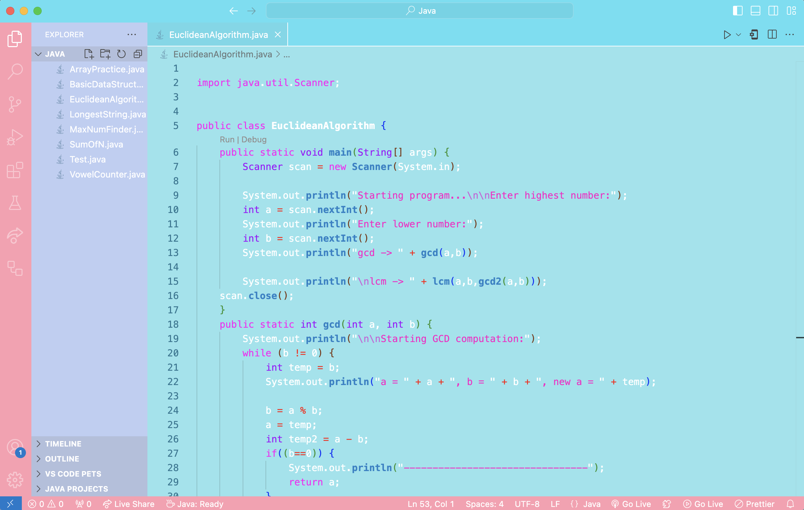

## Preview

# aespa-theme README
### aespa Theme for VSCode
    This is a fan-made theme for Visual Studio Code, inspired by the vibrant and colorful aesthetics of the K-pop girl group aespa. This theme is not an official product, and it is not affiliated, endorsed, or licensed by aespa or SM Entertainment.

### License

    This theme is released under the MIT License. You can freely use, modify, and distribute this theme, but please note that:
	•	aespa and SM Entertainment hold the rights to the name, logos, and other official branding of aespa. This theme is simply inspired by the group’s colors and aesthetic, and does not use any copyrighted images or trademarks of aespa.
	•	By using or distributing this theme, you agree to the terms of the MIT License, which is provided in the LICENSE.md file.

### Disclaimer

	•	This theme is not officially associated with aespa or SM Entertainment.
	•	The use of the aespa name and inspiration from their colors and visuals is purely for the purpose of a fan-made creation.
	•	Any trademarks or copyrights related to aespa and SM Entertainment are respected and remain their property.

You can author your README using Visual Studio Code. Here are some useful editor keyboard shortcuts:

* Split the editor (`Cmd+\` on macOS or `Ctrl+\` on Windows and Linux).
* Toggle preview (`Shift+Cmd+V` on macOS or `Shift+Ctrl+V` on Windows and Linux).
* Press `Ctrl+Space` (Windows, Linux, macOS) to see a list of Markdown snippets.

## For more information

* [Visual Studio Code's Markdown Support](http://code.visualstudio.com/docs/languages/markdown)
* [Markdown Syntax Reference](https://help.github.com/articles/markdown-basics/)

**Enjoy!**
